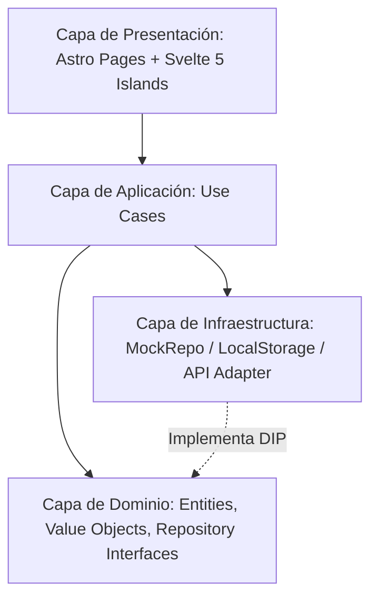

# AlethiaGateway 📖⚡

> *«Conoceréis la verdad, y la verdad os hará libres.»*  
> **AlethiaGateway** es una plataforma web moderna, ultrarrápida y accesible para la lectura, búsqueda y estudio comparativo de la Biblia en español.

---

## 📌 Tabla de Contenidos
- [Características Principales](#-características-principales)
- [Estrategia de Versionado (SemVer)](#-estrategia-de-versionado-semver)
- [Arquitectura de Software](#-arquitectura-de-software)
- [Stack Tecnológico](#-stack-tecnológico)
- [Estructura del Proyecto](#-estructura-del-proyecto)
- [Primeros Pasos](#-primeros-pasos)
- [Comandos Disponibles](#-comandos-disponibles)
- [Historial de Cambios (Changelog)](#-historial-de-cambios-changelog)
- [Licencia](#-licencia)

---

## ✨ Características Principales

- **⚡ Arquitectura de Islas con Zero-JS por Defecto**: Construido sobre **Astro 5** para máxima velocidad de carga y SEO óptimo.
- **🔄 Comparador Multiversión en Paralelo**: Contrasta hasta 5 traducciones en español simultáneamente (*RVC, NBLA, NVI, NTV, TLA*) en columnas interactivas.
- **🎨 Sistema de Diseño Neobrutalista**: Estética retro-moderna con contornos negros marcados, sombras duras (`box-shadow: 5px 5px 0 #000`) y paleta de alto contraste.
- **📱 Sidebar y Topbar Adaptables (AppShell)**: Modo expandido (`260px`), colapsado compacto tipo riel (`72px`) para escritorio y cajón móvil (*drawer*) con fondo translúcido.
- **🔖 Biblioteca y Marcadores Locales**: Persistencia de lecturas y pasajes guardados en el navegador mediante `localStorage`.
- **🧩 Principios SOLID & Screaming Architecture**: Separación estricta entre Dominio, Casos de Uso, Infraestructura y Presentación.

---

## 🏷️ Estrategia de Versionado (SemVer)

Este proyecto adopta estrictamente la especificación **[Semantic Versioning 2.0.0 (SemVer)](https://semver.org/)**.

El formato de versión sigue el esquema: `MAJOR.MINOR.PATCH` (ej. `v1.0.0`):

| Segmento | Incremento Cuando... | Ejemplo |
| :--- | :--- | :--- |
| **MAJOR (X.0.0)** | Se introducen cambios incompatibles o de ruptura en la arquitectura o contratos de API/Dominio. | `1.0.0` → `2.0.0` |
| **MINOR (0.X.0)** | Se añade nueva funcionalidad de negocio retrocompatible (ej. nuevo proveedor de audio, sistema de notas). | `1.0.0` → `1.1.0` |
| **PATCH (0.0.X)** | Se realizan correcciones de errores, ajustes de estilos o parches retrocompatibles. | `1.0.0` → `1.0.1` |

---

## 🏛️ Arquitectura de Software

La aplicación implementa **Clean Architecture** y **Screaming Architecture**:



### Principios SOLID en el Código:
- **S (Single Responsibility):** Entidades como `PassageReference` solo se encargan del parseo y validación de citas bíblicas.
- **O (Open/Closed):** Nuevas fuentes de datos bíblicas se añaden implementando `IBibleRepository` sin modificar casos de uso.
- **L (Liskov Substitution):** Adaptadores locales o remotos son sustituibles de forma transparente.
- **I (Interface Segregation):** Interfaces reducidas y especializadas (`IBibleRepository`, `IBookmarkRepository`).
- **D (Dependency Inversion):** Los componentes y la aplicación dependen de abstracciones (interfaces), nunca de implementaciones concretas.

---

## 🛠️ Stack Tecnológico

- **Framework Web**: [Astro 5](https://astro.build/)
- **Librería de UI / Reactividad**: [Svelte 5](https://svelte.dev/) con *Runes* (`$state`, `$derived`, `$props`, `$effect`)
- **Estilos y Utilidades**: [Tailwind CSS v4](https://tailwindcss.com/) (`@tailwindcss/vite`, `clsx`, `tailwind-merge`)
- **Iconografía**: [Lucide Svelte](https://lucide.dev/)
- **Lenguaje**: [TypeScript 5.9](https://www.typescriptlang.org/)
- **Entorno / Gestor de Paquetes**: [Bun](https://bun.sh/)

---

## 📁 Estructura del Proyecto

```text
alethiagateway/
├── public/
│   ├── favicon.svg                # Monograma vectorial Neobrutalista
│   ├── favicon.ico                # Favicon binario ICO estándar
│   └── icon.svg
├── src/
│   ├── modules/                   # Módulos de dominio de negocio (Screaming)
│   │   ├── bible-reader/          # Módulo principal de lectura bíblica
│   │   │   ├── domain/            # Entities, Value Objects, IBibleRepository
│   │   │   ├── application/       # CompareTranslations, GetChapter, Search
│   │   │   ├── infrastructure/    # MockBibleRepository, bible-data
│   │   │   └── ui/                # Componentes Svelte 5 (BibleReaderApp, ReaderView, etc.)
│   │   └── bookmarks/             # Módulo de biblioteca y favoritos
│   │       ├── domain/            # Bookmark, IBookmarkRepository
│   │       └── infrastructure/    # LocalStorageBookmarkRepository
│   ├── shared/
│   │   ├── ui/                    # AppShell.svelte, Sidebar.svelte, Topbar.svelte
│   │   ├── styles/                # globals.css (Tokens neobrutalistas)
│   │   └── utils/                 # cn.ts
│   ├── layouts/
│   │   └── RootLayout.astro       # Shell HTML, fuentes y metadatos SEO
│   └── pages/
│       └── index.astro            # Punto de entrada con hidratación de islas
├── astro.config.mjs
├── tsconfig.json
├── package.json
└── README.md
```

---

## 🚀 Primeros Pasos

### Requisitos Previos
- Tener instalado [Bun](https://bun.sh/) (v1.1+ recomendado) o [Node.js](https://nodejs.org/) (v20+).

### Instalación

1. Clonar el repositorio:
   ```bash
   git clone https://github.com/tu-usuario/alethiagateway.git
   cd alethiagateway
   ```

2. Instalar dependencias:
   ```bash
   bun install
   ```

3. Iniciar el servidor de desarrollo:
   ```bash
   bun run dev
   ```
   Abre [http://localhost:4321](http://localhost:4321) en tu navegador.

---

## 📜 Comandos Disponibles

| Comando | Descripción |
| :--- | :--- |
| `bun run dev` | Inicia el servidor de desarrollo local de Astro. |
| `bun run build` | Compila y optimiza la aplicación para producción en `dist/`. |
| `bun run preview` | Previsualiza localmente el build de producción. |
| `bun run check` | Ejecuta el análisis estático de tipos TypeScript y diagnósticos de Astro. |

---

## 📋 Historial de Cambios (Changelog)

### [0.6.2] - 2026-08-25
#### Añadido: Reina Valera Gómez & Corrección de Zacarías
- 📖 **Integración de Reina Valera Gómez (2010)** (`SpaRVG` / `RVG`):
  - Ingesta y conversión completa de los 66 libros canónicos (1,189 capítulos, 31,102 versículos) desde el módulo Sword LZSS (`modules/texts/ztext/sparvg/`) a JSON optimizado en `public/data/bibles/SpaRVG/`.
  - Implementación de descompresor ultra-rápido de LZSS en `scripts/convert-sparvg.py` con caché de buffers en memoria.
  - Registro de metadatos y disponibilidad inmediata en los selectores paralelos del lector.
- 🐛 **Corrección del Libro de Zacarías (`ZEC`)**:
  - Restaurada la entrada del libro de **Zacarías** (`code: 'ZEC'`, 14 capítulos, categoría *Profetas Menores*) en `BibleBooks.ts`, resolviendo su visibilidad en el modal de selección de libros bíblicos y en las búsquedas.

### [0.6.1] - 2026-08-23
#### Corregido & Mejorado: Soporte Completo de Versículos Agrupados y Rangos Bíblicos
- 📖 **Corrección en Parser y Generación de Versiones JSON**:
  - Implementación de `parseVerseSpan()` en `scripts/convert-bibles.ts` para extraer con precisión etiquetas y rangos de versículos (`2-4`, `3-14`, `26-47`, `1-11`, etc.).
  - Regeneración de todas las versiones bíblicas, preservando `verseDisplay` y `endNumber` en más de 1,150 bloques agrupados en traducciones como **ONBV** y **PDDPT**.
- 🔍 **Búsqueda y Filtrado Inteligente en Repositorio**:
  - `JsonBibleRepository` ahora localiza versículos individuales o en rango dentro de bloques agrupados (ej. buscar `1 Crónicas 1:3` resuelve el bloque `2-4` en ONBV).
- 🏷️ **Renderizado en el Lector y Herramientas Flotantes**:
  - `ParallelPassageViewer` renderiza `{verse.verseDisplay || verse.number}`, mostrando claramente las etiquetas de rango.
  - `HighlightFloatingToolbar` y el sistema de notas/resaltados ahora respetan los rangos y etiquetas de versículos al citar, resaltar o crear notas.

### [0.6.0] - 2026-08-22
#### Añadido: Resaltados Persistentes, Notas Personales y Tooltips Neobrutalistas
- 🖍️ **Persistencia de Resaltados Bíblicos**:
  - Implementación de `LocalStorageHighlightRepository` (`alethia_bible_highlights_v1`) y entidad `BibleHighlight` con soporte para 4 colores accesibles (`Amarillo`, `Coral`, `Azul`, `Verde`).
  - Renderizado reactivo y sanitizado de marcas `<mark class="bible-highlight">` en el lector paralelo persistente entre recargas y navegación.
  - Interacción táctil para modificar color o borrar resaltados directamente al hacer clic en ellos o con la herramienta de borrado.
- 💾 **Guardado Directo desde el Toolbar Flotante**:
  - Función de guardado inmediato de citas y fragmentos seleccionados en `LocalStorageBookmarkRepository` con feedback visual inmediato.
- 📝 **Notas Personales y Reflexiones**:
  - Modal accesible `PersonalNoteModal` con estética Neobrutalista, atajo de teclado (`Ctrl + Enter`), citas bíblicas automáticas y persistencia en `LocalStorageNoteRepository`.
  - Insignia interactiva de notas en cada versículo del lector para consultar y editar apuntes.
- 💬 **Sistema Global de Tooltips Neobrutalistas**:
  - Creación de `NeoTooltip` con diseño de alto contraste (`#1a1a18`, texto blanco y sombra dura de 3px).
  - Posicionamiento inteligente con cálculo dimensional real y *clamping* en bordes para evitar desbordes o estiramientos verticales.
  - Reemplazo universal de los atributos nativos `title` por `data-tooltip`.

### [0.5.3] - 2026-08-22
#### Corregido & Canon Dinámico
- 📚 **Filtro Canónico Inteligente en la Lista de Libros**:
  - El modal de selección de libros y capítulos (`BookChapterSelectorModal`) ahora reconoce automáticamente si la traducción activa contiene libros deuterocanónicos (`SpaPlatense`).
  - Si `SpaPlatense` no está activa, muestra de forma predeterminada los 66 libros del canon estándar (39 en el Antiguo Testamento y 27 en el Nuevo Testamento), ocultando los 7 libros deuterocanónicos.
  - Al activar `SpaPlatense`, se habilitan dinámicamente los 73 libros canónicos y deuterocanónicos (46 en el AT y 27 en el NT).
  - La navegación secuencial entre capítulos anterior/siguiente ahora respeta el canon de la traducción en uso.

### [0.5.2] - 2026-08-22
#### Añadido & Sincronización
- 🌅 **Sincronización Dinámica del Versículo del Día con la Versión Seleccionada**:
  - La tarjeta del «Versículo del Día» ahora resuelve reactivamente el texto y metadatos en la traducción preferida/activa del usuario (`selectedTranslations[0]`), actualizándose en tiempo real al cambiar de versión en el lector y persistiendo entre sesiones.

### [0.5.1] - 2026-08-22
#### Corregido & Mejoras de Usabilidad
- 🔽 **Dropdown de Versiones sin Recortes**:
  - Eliminación de la restricción de recorte vertical en `.passage-list-parallel`, permitiendo que el selector de traducciones sobresalga con `z-index: 110` sobre la tarjeta de lectura sin generar barras de desplazamiento internas.
  - Añadido scroll interno (`max-height: 320px`) y anclaje inteligente a la derecha en la última columna para pantallas estrechas.
- 📏 **Estandarización de Altura en Buscador**:
  - Unificación visual entre la barra de búsqueda de la pantalla de Inicio y la del Lector bíblico (`54px` de alto, `44px` de wrapper y `38px` de input).
- 💾 **Persistencia del Estado de Lectura**:
  - Almacenamiento en `localStorage` (`alethia_last_passage`) del último pasaje o versículo visitado al navegar o buscar, permitiendo reanudar la lectura directamente al reingresar a «Leer la Biblia» o recargar la página.
  - Persistencia de las traducciones seleccionadas en paralelo (`alethia_selected_translations`).
- 🧼 **Buscador de Inicio Independiente y Limpio**:
  - Desacoplamiento del estado de búsqueda de Inicio respecto al pasaje activo del lector, manteniendo el buscador de Inicio limpio para nuevas búsquedas.
- 🔤 **Cierre Inteligente en Selector de Tipografía**:
  - Detección de clics externos para cerrar automáticamente el dropdown de tamaño de fuente.

### [0.5.0] - 2026-08-22
#### Añadido: Biblia Platense (Straubinger) & Conversor de Módulos Sword
- ✝️ **Integración de la Biblia Platense (Straubinger)** (`SpaPlatense`):
  - Ingesta y conversión integral de los 73 libros canónicos y deuterocanónicos (1,334 capítulos, 35,792 versículos) desde formato Sword zText comprimido (`modules/texts/ztext/spaplatense/`) a JSON estructurado y optimizado en `public/data/bibles/SpaPlatense/`.
  - Extracción completa de los comentarios exegéticos y notas al pie de Mons. Juan Straubinger y títulos de sección OSIS.
  - Soporte canónico para libros deuterocanónicos: Tobías (`TOB`), Judit (`JDT`), Sabiduría (`WIS`), Eclesiástico (`SIR`), Baruc (`BAR`), 1 Macabeos (`1MA`), 2 Macabeos (`2MA`) con sus respectivos alias de búsqueda en `BibleBooks.ts`.
- 🛠️ **Script Automatizado de Conversión Sword**:
  - `scripts/convert-spaplatense.py`: pipeline de descompresión zlib, parseo OSIS XML/BeautifulSoup y generación de JSON estructurado.

### [0.4.3] - 2026-08-21
#### Añadido & Perfeccionamiento Responsive
- 🌅 **Motor Determinista del Versículo del Día (366 Días)**:
  - Implementación del catálogo curado de 366 versículos bíblicos (`DailyVerseCatalog.ts`), asignando un pasaje único e inspirador para cada día del año sin repeticiones.
  - Cálculo determinista automático por fecha y día del año (`Day of Year`).
  - Resolución dinámica del texto real del versículo desde `JsonBibleRepository`.
  - Distintivo de fecha actual formateada en español en la cabecera de la tarjeta (*ej. «21 de agosto de 2026»*).
- 📱 **Diseño Adaptativo Vertical para Comparador en Tablet y Móvil**:
  - En pantallas medianas y pequeñas (`<= 960px`), las columnas paralelas (hasta 5 versiones) se transforman automáticamente en un **apilamiento vertical continuo**, garantizando un ancho completo del 100%, lectura tipográfica holgada y selectores sin deformación.
- 🏷️ **Opciones del Menú Lateral con Estado «Pronto»**:
  - Los módulos en desarrollo (*Planes de lectura*, *Devocionales*, *Audio Biblia*, *Recursos*, *Configuración*) se presentan claramente deshabilitados con el badge neobrutalista `[Pronto]`.

### [0.4.2] - 2026-08-21
#### Mejorado & Ajustes de Experiencia de Usuario
- 📖 **Carga de Capítulo Completo desde el Modal de Libros**:
  - Al seleccionar un capítulo en el modal (*Lista de libros bíblicos*), ahora carga de forma predeterminada el capítulo entero (todos sus versículos) en lugar de un único versículo parcial.
- ◀ ▶ **Botones Flotantes de Navegación Fijos en Pantalla**:
  - Los botones de capítulo anterior `<` y siguiente `>` ahora permanecen **fijos en el viewport** (`position: fixed; top: 50vh`), accesibles en cualquier punto del scroll sin importar la longitud del capítulo.
- 🧹 **Depuración del Menú Lateral**:
  - Eliminación del enlace redundante «Buscar pasajes» del sidebar para mantener una navegación limpia y focalizada.

### [0.4.1] - 2026-08-21
#### Añadido & Búsqueda Avanzada Estilo BibleGateway
- 🔍 **Buscador Multi-Pasajes y Nomenclaturas Flexibles**:
  - Soporte de múltiples pasajes en una sola búsqueda separados por punto y coma (ej. `Genesis 1:1; Génesis 2:1-2; Gen 3:1,6; 5`).
  - Reconocimiento de variaciones fonéticas, abreviaturas (`Gen`, `1Cor`, `Sal`, `Lv`), omisión de tildes y versículos discontinuos con comas (`3:1,6`).
  - Herencia automática de contexto del libro en listas compuestas (ej. `5` tras `Gen 3:1,6` se interpreta como `Génesis 5`).
- 📜 **Apilamiento Vertical de Bloques de Pasajes**:
  - Cada pasaje consultado se lista verticalmente hacia abajo con su propio identificador y botón interactivo `[ 📖 Leer el capítulo completo ➔ ]`.
- 📌 **Notas al Pie al Final con Enlaces Interactivos**:
  - Llamadas de nota en superíndice `[*]` junto al versículo con desplazamiento suave al pulsar hacia la sección de notas al pie al final de la columna.
- ⚖️ **Aviso Legal y Derechos de Autor por Columna**:
  - Bloque tipográfico al pie de cada versión mostrando nombre oficial, titularidad y licencia de uso (ej. *Biblica® Nueva Biblia Viva, © Biblica, Inc.*).

### [0.4.0] - 2026-08-21
#### Añadido & Ingesta Real de Datos
- 📖 **7 Versiones Bíblicas Reales y Completas en JSON**:
  - Ingesta y conversión de más de 9.500 archivos HTML en `public/data/bibles/` organizados por libros y capítulos.
  - Versiones integradas: **RV1909** (*Reina Valera 1909*), **BES** (*Biblia en Español Sencillo*), **VBL** (*Versión Biblia Libre*), **PDDPT** (*Palabra de Dios para ti*), **ONBV** (*Open Nueva Biblia Viva*), **BLL** (*Biblia Libre Latinoamericano*), **BLM** (*Biblia Libre para el Mundo*).
- 🏷️ **Soporte Total de Metadatos Bíblicos**:
  - Extracción y renderizado de títulos y encabezados de sección (`.verse-section-heading`).
  - Extracción y renderizado de notas al pie y variantes textuales por versículo (`.verse-footnote-item`).
- ⚡ **Repositorio `JsonBibleRepository`**:
  - Carga diferida (*lazy loading*) con caché en memoria por libro para una experiencia de lectura fluida e instantánea (0ms de latencia).
  - Eliminación total de datos simulados/hardcodeados.
- 🛠️ **Pipeline Automatizado CLI (`scripts/convert-bibles.ts`)**:
  - Script en Bun/TypeScript para parseo de alta velocidad de biblias en HTML hacia esquemas JSON estructurados.

### [0.3.2] - 2026-08-21
#### Añadido & Rediseñado
- 🏠 **Rediseño del Inicio al Estilo BibleGateway**:
  - Buscador principal superior con placeholder limpio y sin textos hardcodeados.
  - Sub-barra de herramientas con acceso directo al modal de libros bíblicos y selector de tamaño de fuente.
  - Tarjeta destacada única de **Versículo del Día** con enlace directo para leer el capítulo completo en el lector.
  - Ajuste de altura compacto al viewport sin scroll vertical innecesario.
  - Ancho unificado y coherente con la vista de lectura bíblica (`1200px` / `1440px`).
  - Escalado tipográfico reactivo del Versículo del Día al cambiar el tamaño de fuente.

### [0.3.1] - 2026-08-21
#### Añadido & Mejorado
- 🖍️ **Motor de Resaltado Bíblico (Estilo BibleGateway)**: Barra de herramientas flotante al seleccionar texto con 4 colores (amarillo, coral, azul, verde), borrador de resaltado, copiado rápido con cita formateada y notas.
- 🎨 **Selector de Versión por Columna Neobrutalista Flotante**: Menú desplegable sin scrollbars artificiales que desborda limpiamente por encima del contenedor con sombra dura y cierre al hacer clic fuera (*click-outside*).
- 🔍 **Buscador Alargado Superior**: Barra de búsqueda a ancho completo (`100%`) en la cabecera del lector, eliminando encabezados gigantes redundantes y maximizando el espacio de lectura.
- ◀ ▶ **Botones Flotantes Exteriores y Centrados**: Navegación de capítulos situada en el eje vertical medio exacto de la tarjeta y fuera del área de versículos para evitar solapamientos.
- 📐 **Altura Adaptativa al Contenido**: El contenedor del lector ajusta dinámicamente su altura según la cantidad de versículos en pantalla.
- 🎨 **Sombreado Temático de Selección (`::selection`)**: El texto seleccionado adopta el color principal del tema activo (`#FFD23F` en modo estándar y `#ffeaa7` en Modo Calma).
- 📐 **Selector de Tamaño de Fuente Ampliado**: Menú espacioso con etiquetas legibles sin truncamiento (`X-Grande` a `X-Pequeño`).
- 🧹 **Limpieza de Elementos Redundantes**: Eliminación del anuncio inferior («Guarda tu lectura»), del botón de compartir no funcional y de las flechas redundantes en la barra de herramientas.

### [0.3.0] - 2026-08-21
#### Añadido
- 🗂️ **Botón «+ Agregar paralelo»**: Adición dinámica de hasta 5 versiones en paralelo, eliminando botones fijos y optimizando espacio.
- 🔄 **Selector de Versión por Columna**: Menú desplegable neobrutalista individual por columna con botón de cierre (`✕`) dedicado.
- 📖 **Modal «Lista de libros bíblicos»**: Selector estructurado en 3 columnas (Antiguo Testamento, Nuevo Testamento y Capítulos) con filtro de búsqueda instantáneo.
- 🔤 **Selector de Tamaño de Fuente**: Menú de ajuste tipográfico (X-Grande, Grande, Medio, Pequeño, X-Pequeño) con persistencia en `localStorage`.
- ◀ ▶ **Navegación de Capítulos Optimizada**: Botones laterales táctiles esbeltos e indicadores integrados en la barra de herramientas.
- 📱 **Sidebar Móvil Refinado**: Cajón amplio y limpio que se cierra haciendo clic fuera sin elementos invasivos.
- 🎯 **Foco Limpio en Buscador**: Borde negro enfocado exclusivamente en el campo de texto.

### [0.2.0] - 2026-08-21
#### Añadido
- 🧠 **Design System Maestro**: Integración de pautas neurocognitivas WCAG 2.2 AAA / Criterio 1.4.12, control sacádico de lectura (`65ch`), tipografías (`Syne`, `Archivo Black`, `Inter`, `JetBrains Mono`, `Lexend`) y cinemática mecánica 1:1.
- ✨ **Modo Calma & Dislexia**: Alternador de tema suave anti-estrés visual (`body.mode-calm`) con persistencia en `localStorage`.
- 📖 **Comparador de 5 Versiones Continuo**: Lectura en paralelo en una sola fila horizontal fluida con crecimiento vertical dinámico.
- 📐 **Expansión Dinámica de Espacio**: Adaptación automática a `1420px` al colapsar el sidebar.
- 🎚️ **Scrollbar Temático Neobrutalista**: Barra de desplazamiento aislada debajo del Topbar respetando el tema activo.
- 🔍 **Buscador con Marco Interior de Selección**: Efecto de marco negro definido al enfocar/seleccionar sin cortar el icono.

### [0.1.0] - 2026-08-21 (Propuesta Inicial)
#### Añadido
- ✨ Migración completa de la arquitectura base desde Next.js a **Astro 5 + Svelte 5**.
- 🏛️ Reestructuración bajo **Screaming Architecture** y principios **SOLID**.
- 📖 Comparador multiversión en paralelo con soporte de hasta 5 traducciones en español (`RVC`, `NBLA`, `NVI`, `NTV`, `TLA`).
- 🎨 Sistema de diseño **Neobrutalista** con soporte fluido de viewport en pantalla completa.
- 📱 Componente unificado `AppShell.svelte` con Sidebar colapsable (`260px` ↔ `72px`) y modo cajón móvil.
- 🔖 Sistema de persistencia de marcadores con `LocalStorageBookmarkRepository`.
- 🖼️ Iconografía y favicon oficial (`favicon.svg` y `favicon.ico`) con monograma AlethiaGateway.

---

## 📄 Licencia

Este proyecto está bajo la Licencia MIT. Consulta el archivo `LICENSE` para más detalles.
