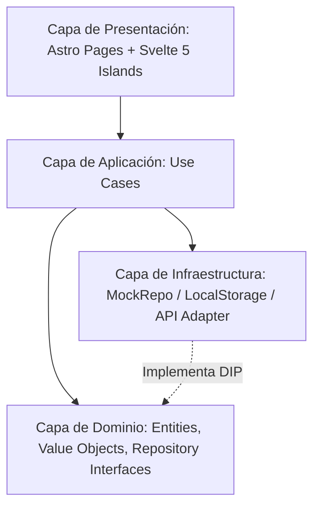

# AlethiaGateway 📖⚡

> *«Conoceréis la verdad, y la verdad os hará libres.»*  
> **AlethiaGateway** es una plataforma web moderna, ultrarrápida y accesible para la lectura, búsqueda y estudio comparativo de la Biblia en español.

---

## 📌 Tabla de Contenidos
- [Características Principales](#-características-principales)
- [Estrategia de Versionado (SemVer)](#-estrategia-de-versionado-semver)
- [Arquitectura de Software](#-arquitectura-de-software)
- [Stack Tecnológico](#-stack-tecnológico)
- [Estructura del Proyecto](#-estructura-del-proyecto)
- [Primeros Pasos](#-primeros-pasos)
- [Comandos Disponibles](#-comandos-disponibles)
- [Historial de Cambios (Changelog)](#-historial-de-cambios-changelog)
- [Licencia](#-licencia)

---

## ✨ Características Principales

- **⚡ Arquitectura de Islas con Zero-JS por Defecto**: Construido sobre **Astro 5** para máxima velocidad de carga y SEO óptimo.
- **🔄 Comparador Multiversión en Paralelo**: Contrasta hasta 5 traducciones en español simultáneamente (*RVC, NBLA, NVI, NTV, TLA*) en columnas interactivas.
- **🎨 Sistema de Diseño Neobrutalista**: Estética retro-moderna con contornos negros marcados, sombras duras (`box-shadow: 5px 5px 0 #000`) y paleta de alto contraste.
- **📱 Sidebar y Topbar Adaptables (AppShell)**: Modo expandido (`260px`), colapsado compacto tipo riel (`72px`) para escritorio y cajón móvil (*drawer*) con fondo translúcido.
- **🔖 Biblioteca y Marcadores Locales**: Persistencia de lecturas y pasajes guardados en el navegador mediante `localStorage`.
- **🧩 Principios SOLID & Screaming Architecture**: Separación estricta entre Dominio, Casos de Uso, Infraestructura y Presentación.

---

## 🏷️ Estrategia de Versionado (SemVer)

Este proyecto adopta estrictamente la especificación **[Semantic Versioning 2.0.0 (SemVer)](https://semver.org/)**.

El formato de versión sigue el esquema: `MAJOR.MINOR.PATCH` (ej. `v1.0.0`):

| Segmento | Incremento Cuando... | Ejemplo |
| :--- | :--- | :--- |
| **MAJOR (X.0.0)** | Se introducen cambios incompatibles o de ruptura en la arquitectura o contratos de API/Dominio. | `1.0.0` → `2.0.0` |
| **MINOR (0.X.0)** | Se añade nueva funcionalidad de negocio retrocompatible (ej. nuevo proveedor de audio, sistema de notas). | `1.0.0` → `1.1.0` |
| **PATCH (0.0.X)** | Se realizan correcciones de errores, ajustes de estilos o parches retrocompatibles. | `1.0.0` → `1.0.1` |

---

## 🏛️ Arquitectura de Software

La aplicación implementa **Clean Architecture** y **Screaming Architecture**:



### Principios SOLID en el Código:
- **S (Single Responsibility):** Entidades como `PassageReference` solo se encargan del parseo y validación de citas bíblicas.
- **O (Open/Closed):** Nuevas fuentes de datos bíblicas se añaden implementando `IBibleRepository` sin modificar casos de uso.
- **L (Liskov Substitution):** Adaptadores locales o remotos son sustituibles de forma transparente.
- **I (Interface Segregation):** Interfaces reducidas y especializadas (`IBibleRepository`, `IBookmarkRepository`).
- **D (Dependency Inversion):** Los componentes y la aplicación dependen de abstracciones (interfaces), nunca de implementaciones concretas.

---

## 🛠️ Stack Tecnológico

- **Framework Web**: [Astro 5](https://astro.build/)
- **Librería de UI / Reactividad**: [Svelte 5](https://svelte.dev/) con *Runes* (`$state`, `$derived`, `$props`, `$effect`)
- **Estilos y Utilidades**: [Tailwind CSS v4](https://tailwindcss.com/) (`@tailwindcss/vite`, `clsx`, `tailwind-merge`)
- **Iconografía**: [Lucide Svelte](https://lucide.dev/)
- **Lenguaje**: [TypeScript 5.9](https://www.typescriptlang.org/)
- **Entorno / Gestor de Paquetes**: [Bun](https://bun.sh/)

---

## 📁 Estructura del Proyecto

```text
alethiagateway/
├── public/
│   ├── favicon.svg                # Monograma vectorial Neobrutalista
│   ├── favicon.ico                # Favicon binario ICO estándar
│   └── icon.svg
├── src/
│   ├── modules/                   # Módulos de dominio de negocio (Screaming)
│   │   ├── bible-reader/          # Módulo principal de lectura bíblica
│   │   │   ├── domain/            # Entities, Value Objects, IBibleRepository
│   │   │   ├── application/       # CompareTranslations, GetChapter, Search
│   │   │   ├── infrastructure/    # MockBibleRepository, bible-data
│   │   │   └── ui/                # Componentes Svelte 5 (BibleReaderApp, ReaderView, etc.)
│   │   └── bookmarks/             # Módulo de biblioteca y favoritos
│   │       ├── domain/            # Bookmark, IBookmarkRepository
│   │       └── infrastructure/    # LocalStorageBookmarkRepository
│   ├── shared/
│   │   ├── ui/                    # AppShell.svelte, Sidebar.svelte, Topbar.svelte
│   │   ├── styles/                # globals.css (Tokens neobrutalistas)
│   │   └── utils/                 # cn.ts
│   ├── layouts/
│   │   └── RootLayout.astro       # Shell HTML, fuentes y metadatos SEO
│   └── pages/
│       └── index.astro            # Punto de entrada con hidratación de islas
├── astro.config.mjs
├── tsconfig.json
├── package.json
└── README.md
```

---

## 🚀 Primeros Pasos

### Requisitos Previos
- Tener instalado [Bun](https://bun.sh/) (v1.1+ recomendado) o [Node.js](https://nodejs.org/) (v20+).

### Instalación

1. Clonar el repositorio:
   ```bash
   git clone https://github.com/tu-usuario/alethiagateway.git
   cd alethiagateway
   ```

2. Instalar dependencias:
   ```bash
   bun install
   ```

3. Iniciar el servidor de desarrollo:
   ```bash
   bun run dev
   ```
   Abre [http://localhost:4321](http://localhost:4321) en tu navegador.

---

## 📜 Comandos Disponibles

| Comando | Descripción |
| :--- | :--- |
| `bun run dev` | Inicia el servidor de desarrollo local de Astro. |
| `bun run build` | Compila y optimiza la aplicación para producción en `dist/`. |
| `bun run preview` | Previsualiza localmente el build de producción. |
| `bun run check` | Ejecuta el análisis estático de tipos TypeScript y diagnósticos de Astro. |

---

## 📋 Historial de Cambios (Changelog)

### [0.1.0] - 2026-08-21 (Propuesta Inicial)
#### Añadido
- ✨ Migración completa de la arquitectura base desde Next.js a **Astro 5 + Svelte 5**.
- 🏛️ Reestructuración bajo **Screaming Architecture** y principios **SOLID**.
- 📖 Comparador multiversión en paralelo con soporte de hasta 5 traducciones en español (`RVC`, `NBLA`, `NVI`, `NTV`, `TLA`).
- 🎨 Sistema de diseño **Neobrutalista** con soporte fluido de viewport en pantalla completa.
- 📱 Componente unificado `AppShell.svelte` con Sidebar colapsable (`260px` ↔ `72px`) y modo cajón móvil.
- 🔖 Sistema de persistencia de marcadores con `LocalStorageBookmarkRepository`.
- 🖼️ Iconografía y favicon oficial (`favicon.svg` y `favicon.ico`) con monograma AlethiaGateway.

---

## 📄 Licencia

Este proyecto está bajo la Licencia MIT. Consulta el archivo `LICENSE` para más detalles.
